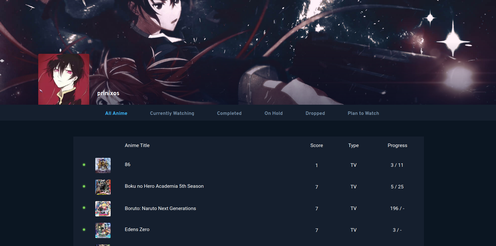
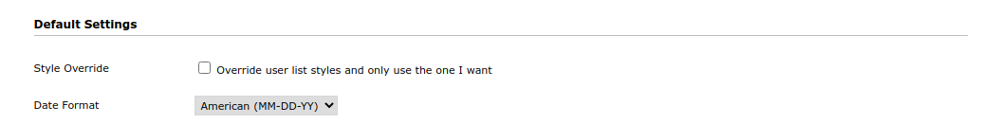
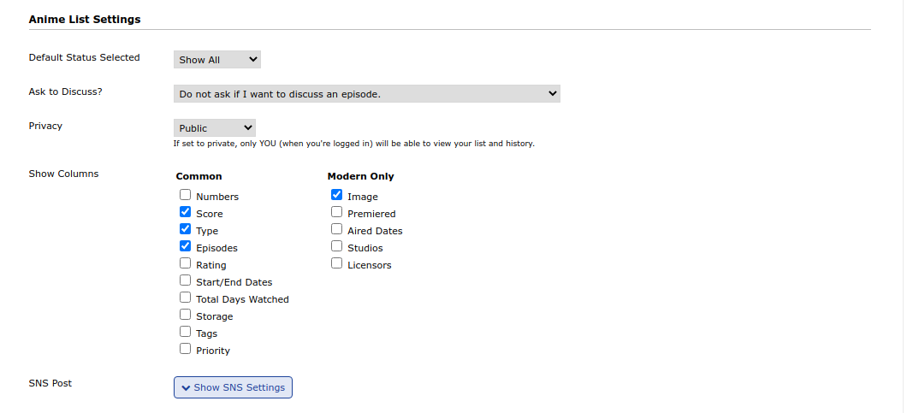
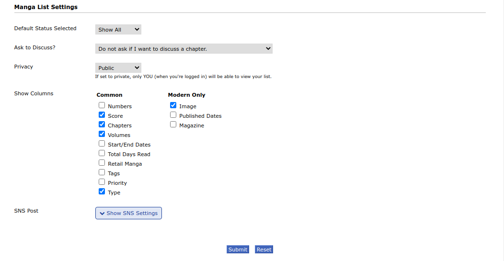
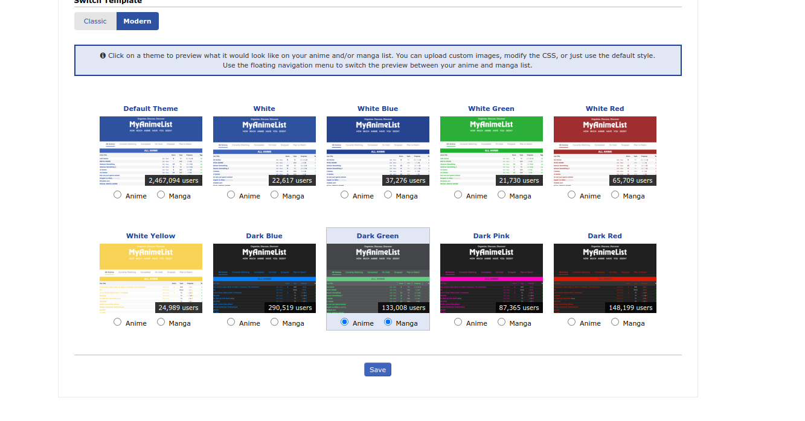

# MYANIMELIST-CSS



## WHY YOU NEED TO USE IT

Don't get fooled by such a wonderful design it's not Anilist but its MAL. So as
a silly weeb you are you would be thinking why prinix **why I need to change my
MAL list style?** The answer is really simple because it sucks it looks like
some old dude with bald head make it with chopsticks and glue but on the other
hand Anilist looks like OMG it looks like heaven on virtual earth the styling
the animation and the image preview it's so good.

Then there would be the second question. **Why not we use Anilist instead of MAL?**<br>
Well you can absolutely do that, but you have also known for a fact that there are way more users in MAL than Anilist have, so I will suggest you to use both I use Anilist for day to day work and I update MAL one in a month so that its stats will always be updated

Then the third question comes to your mind is prinix do we have to MAL monthly update manually than no I use this amazing repository [ALExport](https://github.com/MajorApplePie/ALExport) it can easily export all things from Anilist and what you have to is simply import it in you MAL account sound easy AF right I know.

## INSTALLATION

- **STEP-1 :** First you have to go to your list preference. [Click me.](https://myanimelist.net/editprofile.php?go=listpreferences)
- **STEP-2 :** Check whether your settings are same as mine or not.
  
  
  
  And then click the **submit** button

- **STEP-3 :** Then go to the following link https://myanimelist.net/ownlist/style and choose Dark green for anime and manga
  
  And click **save**.

- **STEP-4 :** Then go to the following link https://myanimelist.net/ownlist/style/theme/8
  and there click on **Add Custom CSS**. Then there would be a black box appeared below.
- **STEP-5 :** Then go to the following link https://raw.githubusercontent.com/prinixos/myanimelist-css/main/mal.css and copy all the code and paste it into the black box. Then click **Save**
- **STEP-6** : In first and second line of the code change \_\_\_ to your username

```CSS
@import "https://malscraper.azurewebsites.net/covers/anime/___/presets/datatitlebefore";
@import "https://malscraper.azurewebsites.net/covers/manga/___/presets/datatitlebefore";
```

TO

```CSS
@import "https://malscraper.azurewebsites.net/covers/anime/prinixos/presets/datatitlebefore";
@import "https://malscraper.azurewebsites.net/covers/manga/prinixos/presets/datatitlebefore";
```

and

add your profile picture link and change <BR>

**THIS TO**

```CSS
.cover-block::before {background-image: url('')}
```

**THIS**

```CSS
.cover-block::before {background-image: url('https://cdn.myanimelist.net/images/userimages/11120973.jpg?t=1619883600')}
```

- **STEP-6 ( Optional ) :** Change x coordinate of your image to your preference.

```CSS
.cover-block .image-container img {top: -308px}
```

